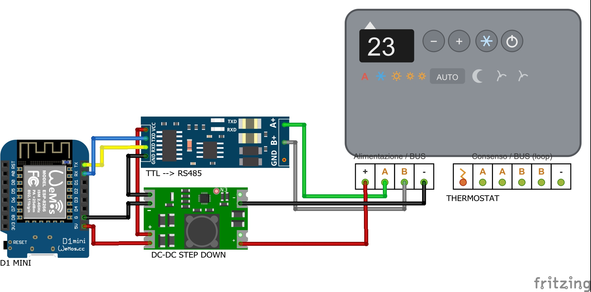

# Fancoil Innova/Airleaf in Home Assistant via ESPHome

Integrazione di fancoil Innova (comandi a muro **EDA649 / EDB649**) in Home
Assistant tramite ESPHome, usando un ESP8266 come master Modbus RTU su RS485.

Il pannello a muro **resta pienamente utilizzabile**: questa configurazione lo
affianca invece di sostituirlo, e i due lati restano allineati in entrambe le
direzioni. Quello che si fa dal pannello compare in Home Assistant, e viceversa.

## Come è fatto

```
Home Assistant  ──WiFi──  D1 mini (ESPHome)  ──RS485──  EDA649/EDB649  ──  fancoil
                                                         (comando a muro)
```

L'ESP non parla direttamente con la scheda del fancoil, ma con il comando a
muro, che a sua volta fa da master verso le unità a valle. È un master che
dialoga con un altro master: da qui derivano diverse particolarità descritte più
avanti.

Il componente `climate` di ESPHome fa da facciata verso Home Assistant. Non
regola nulla per conto proprio: traduce le richieste dell'utente in scritture sui
registri del pannello e riflette in Home Assistant ciò che il pannello riporta.

## Schema di collegamento



### Componenti

* D1 mini (ESP8266)
* Convertitore TTL → RS485
* Step down DC-DC

### Note di cablaggio

L'alimentazione viene prelevata dai morsetti `+` e `-` del bus del pannello e
portata a 5 V dallo step down, che alimenta sia il D1 mini sia il convertitore:
non serve un alimentatore dedicato.

Lato seriale, `TX` del convertitore va su `D1` e `RX` su `D2`; lato bus, `A+` e
`B+` vanno ai morsetti `A` e `B` del pannello e `GND` al `-`.

Il bus lavora a 9600 8N1. Il manuale prescrive cavo bipolare schermato da almeno
0,35 mm², lunghezza totale entro i 500 m, linea terminata con la resistenza da
120 Ω in dotazione, tenuta separata dai cavi di potenza, e vieta i collegamenti a
stella.

## Entità esposte

| Entità | Tipo | Registro |
|---|---|---|
| Termostato | `climate` | vari |
| Temperatura Attuale | `sensor` | 0 |
| Temperatura Richiesta | `number` | 231 |
| Velocità Ventola | `select` | 201 |
| Stagione | `select` | 233 |
| Offset Temperatura Ambiente | `number` | 242 |
| Indirizzo Modbus | `number` | 200 |
| Accensione | `switch` | 201 |
| Modo Notte | `switch` | 201 |
| Stati / Allarme | `text_sensor` | 104 / 105 |
| Standby (STAT) | `binary_sensor` | 104 bit 11 |
| Segnale WiFi, Restart | diagnostica | — |

## Installazione

1. Creare in `secrets.yaml` le voci `wifi_ssid`, `wifi_password`,
   `wifi_password_fallback`, `encryptionkey`, `ota_password`.
2. Copiare il file YAML e adattare il blocco `substitutions`.
3. Compilare e caricare con ESPHome.

Per aggiungere un altro fancoil basta duplicare il file e cambiare le
`substitutions` (più la porta syslog, se lo si usa). Tutto il resto è identico.

```yaml
substitutions:
  devicename: clima-salotto
  ip: 192.168.1.152
  upti: 3s      # intervallo di polling Modbus
  adr: 0x1      # indirizzo del pannello sul proprio bus
```

## Diagnostica opzionale via syslog

In fondo alla sezione `logger` c'è un blocco syslog commentato. Scommentandolo,
il dispositivo invia i log via UDP al
[Syslog Receiver](https://github.com/zollak/homeassistant-syslog-receiver) di
Home Assistant. La porta è univoca per dispositivo (`5` + ultimo ottetto
dell'IP), così ogni termostato finisce in un'istanza separata e i log restano
distinti senza bisogno di filtrare per indirizzo sorgente.

Serve soprattutto per diagnosticare eventi che accadono mentre nessuno guarda —
come le accensioni spontanee descritte più sotto — perché ESPHome non conserva
log sul dispositivo.

## Particolarità del protocollo

Sono i punti che hanno richiesto più lavoro, riportati qui perché non sono
evidenti dal manuale e possono servire a chi parte da zero.

### Il registro 201 è un registro di flag

Non è un elenco di valori alternativi, ma un insieme di bit:

| Bit | Significato |
|---|---|
| 0-1 | Velocità: 0 Auto, 1 Silenzioso, 2 Notturno, 3 Massimo |
| 4 | LOCK (tastiera del pannello bloccata) |
| 7 | Stby (macchina in standby) |
| 8-15 | Riservati di sistema — **da non modificare** |

Scriverlo come valore intero (per esempio `128` per lo standby) azzera i bit
riservati e il flag LOCK. Va aggiornato in **read-modify-write**: si parte
dall'ultimo valore letto e si toccano solo i bit necessari, con la maschera
`0xFF7C`.

Conseguenza pratica: lo standby non è un valore unico. Una macchina spenta con
velocità Massimo vale `131`, non `128`. Una `optionsmap` statica non copre questi
casi e lascia l'entità senza stato.

### Il pannello si riaccende quando l'ESP si riavvia

Verificato dai log: alla prima lettura utile dopo un riavvio, il registro 201
riporta già la macchina accesa e con velocità azzerata ad Auto, prima che
l'ESP abbia scritto qualsiasi cosa. Non è un timeout di comunicazione (il
manuale ne documenta uno da 300 secondi, per tutt'altra configurazione): il
pannello esce da solo dallo standby appena il master sparisce dal bus.

Non è quindi evitabile lato software. La configurazione lo **corregge a
posteriori**:

- `desired_on` e `desired_speed` sono salvati in flash e sopravvivono al riavvio;
- alla prima lettura dopo il boot, se lo stato letto non coincide con quello
  salvato, viene riscritto con una sola operazione;
- `boot_sync_done` blocca ogni scrittura sul bus finché lo stato reale
  dell'unità non è noto, così l'OFF applicato all'avvio non spegne per errore
  una macchina che stava lavorando.

Effetto residuo: dopo un riavvio a macchina spenta, il pannello resta acceso per
circa 2-3 secondi prima di tornare in standby. È il tempo di boot dell'ESP più
un ciclo di polling, e non si può comprimere ulteriormente.

### Il registro stagione non ha uno stato "spento"

Il registro 233 vale solo Inverno o Estate. Poiché `on_value` si attiva ad ogni
pubblicazione — non solo quando il valore cambia — senza una guardia sullo
standby ogni ciclo di polling riaccenderebbe il componente `climate`.

### Un setpoint solo, due nel climate

Il pannello espone un unico setpoint (registro 231), mentre il componente
`climate` di ESPHome con due modalità ne gestisce due. La configurazione propaga
di volta in volta quello attivo secondo la stagione corrente.

## Crediti

Il punto di partenza di questo progetto è
[jjdejong/esphome-airleaf](https://github.com/jjdejong/esphome-airleaf), un
controller ESPHome per fancoil Innova Airleaf collegati alla scheda ECA644.
Grazie all'autore per il lavoro di mappatura iniziale dei registri.

Questa versione è pensata per il collegamento tramite comando a muro EDA649 /
EDB649 e aggiunge la gestione a bit del registro 201, la persistenza dello stato
attraverso i riavvii e la sincronizzazione bidirezionale con il pannello.

## Riferimenti

- Manuale Innova N273025C — collegamento e registri Modbus dei comandi
  EDA649, EDB649, ECA644, ECA647
- [Documentazione ESPHome — Modbus Controller](https://esphome.io/components/modbus_controller.html)

## Licenza

Distribuito con licenza MIT. Vedi il file [LICENSE](LICENSE).
